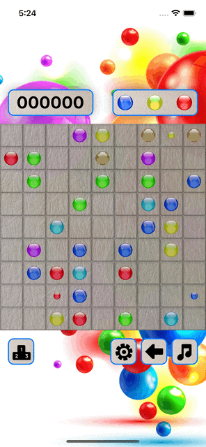

# About

Line is a popular puzzle game that was introduced in many years ago. The game features a simple interface, consisting of a 9x9 grid of empty squares.

The objective of Line is to arrange same-colored balls into horizontal, vertical, or diagonal lines to make them disappear and earn points. When balls vanish, the empty spaces are filled with new balls.

Players can only move one ball at a time with a single touch. The ball will move in a straight line until it encounters an obstacle or reaches the edge of the grid. If there are at least 5 same-colored balls adjacent to each other in a horizontal, vertical, or diagonal formation, they will vanish, and the player will be awarded points.

# Implementation

This game has been implemented with SwiftUI & SpriteKit, using TCA version [1.1.0](https://pointfreeco.github.io/swift-composable-architecture/1.1.0/documentation/composablearchitecture/).

[`Game.swift`](GameCore/Game.swift)
- [`State`](GameCore/Game.swift#L11)
- [`Actions`](GameCore/Game.swift#L19)
- [`Reducer`](GameCore/Game.swift#L33)

[`Settings.swift`](Views/Settings/Settings.swift)
- [`State`](Views/Settings/Settings.swift#L12)
- [`Actions`](Views/Settings/Settings.swift#L17)
- [`Reducer`](Views/Settings/Settings.swift#L27)

# Dependencies

- [`GameStorageClient`](Dependencies/GameStorageClient.swift)
- [`HighScoreManager`](Dependencies/HighScoreManager.swift)
- [`GameSettingsClient`](Dependencies/GameSettingsClient.swift)
- [`AudioPlayer`](Dependencies/AudioPlayer.swift)

# Author

tiennv166, tiennv166@gmail.com
